# 🚀 DevOps AWS Assignment

## 📌 Overview

This project demonstrates deployment of a secure web application on AWS using best DevOps practices.

---
📊 Architecture Diagram: See `architecture.png`

## 🏗️ Architecture

This project follows a secure and scalable AWS architecture design:

* A Virtual Private Cloud (VPC) is created with CIDR block `10.0.0.0/16`.
* The VPC contains **2 Public Subnets** and **2 Private Subnets** across multiple Availability Zones for high availability.

### 🌐 Public Layer

* Public subnets host the **Application Load Balancer (ALB)**.
* An **Internet Gateway (IGW)** is attached to the VPC to allow inbound internet traffic.
* The ALB receives HTTP requests from users and distributes them to backend instances.

### 🔒 Private Layer

* EC2 instances are deployed in private subnets.
* These instances run **Nginx** and serve the web application.
* EC2 instances do NOT have public IP addresses, ensuring security.

### 📡 Outbound Access

* A **NAT Gateway** is deployed in a public subnet.
* Private EC2 instances use the NAT Gateway to access the internet (for updates and package installation).

### 🔗 VPC Endpoints (SSM Access)

* VPC Interface Endpoints are created for:

  * `ssm`
  * `ec2messages`
  * `ssmmessages`
* This allows secure connection to EC2 instances via **Session Manager** without needing SSH or public IP.

### ⚖️ Load Balancing

* An **Application Load Balancer** is configured:

  * Listener: HTTP (Port 80)
  * Routes traffic to a target group
* Target group contains both EC2 instances.
* Health checks ensure only healthy instances receive traffic.

### 🔐 Security

* **ALB Security Group**

  * Allows HTTP (80) from anywhere (0.0.0.0/0)
* **EC2 Security Group**

  * Allows HTTP (80) only from ALB security group
* Direct access to EC2 instances is blocked.

### 🔄 Traffic Flow

User → Internet → ALB (Public Subnet) → EC2 (Private Subnet)

### ✅ Key Features

* High availability across multiple AZs
* Secure architecture (no public EC2 access)
* Scalable load-balanced system
* Managed access via AWS Systems Manager

---

## 📊 Architecture Diagram

---

## 📸 Screenshots

### VPC
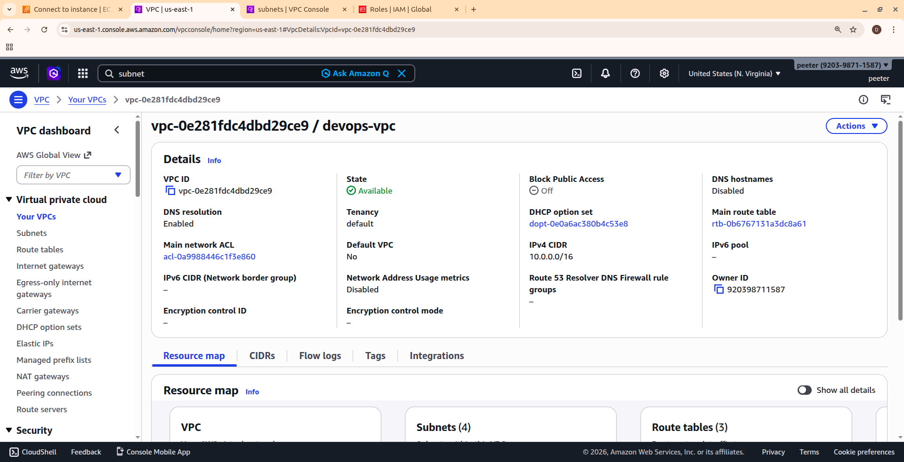

### Subnets
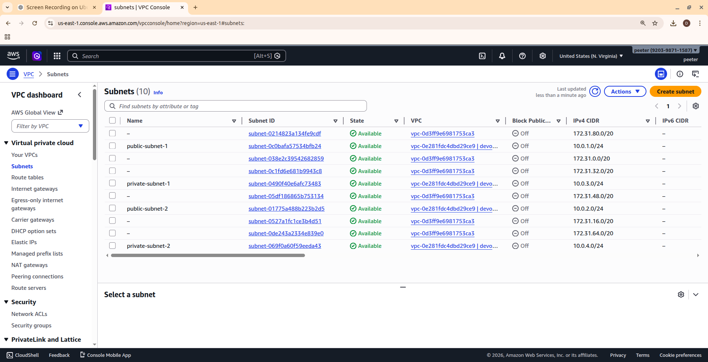

### Internet Gateway
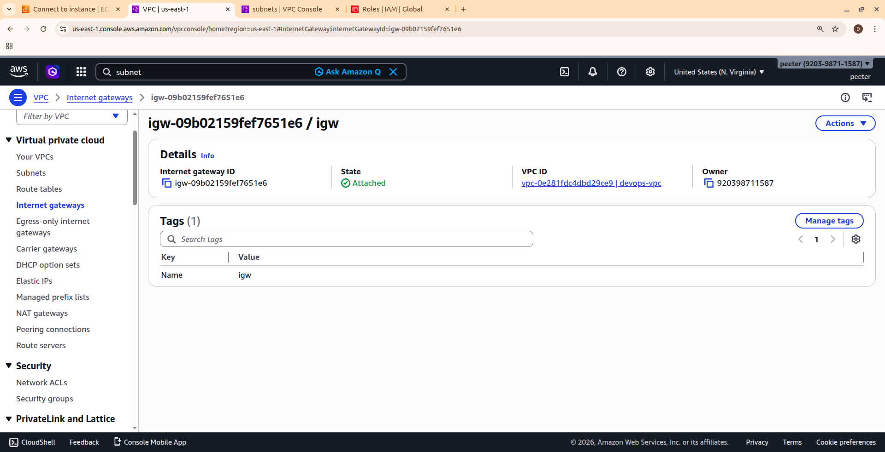

### NAT Gateway
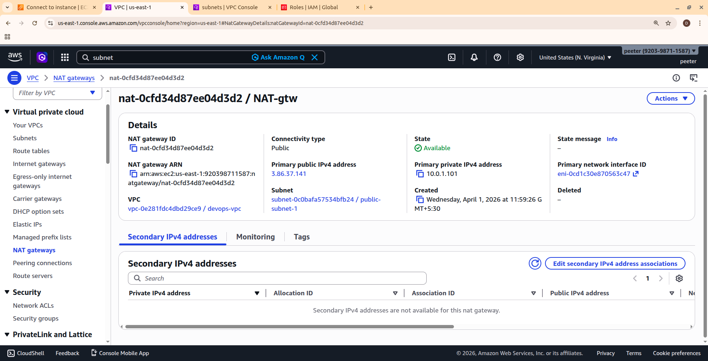

### Public Route Tables

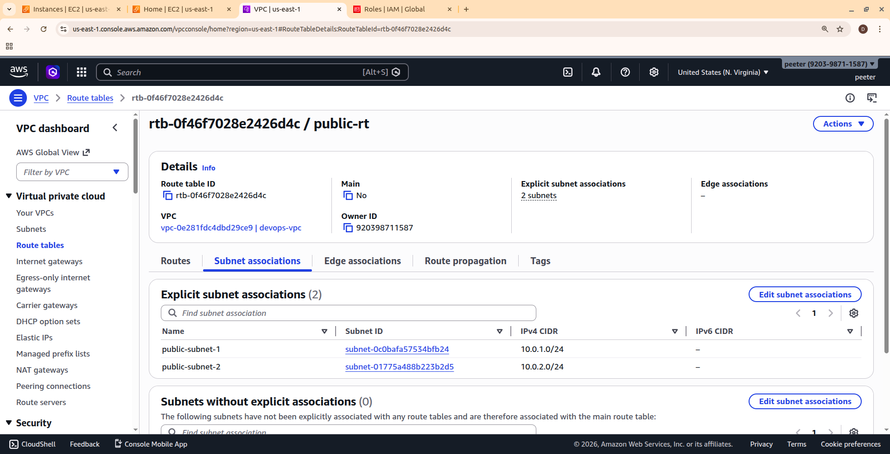

### Private Route Table
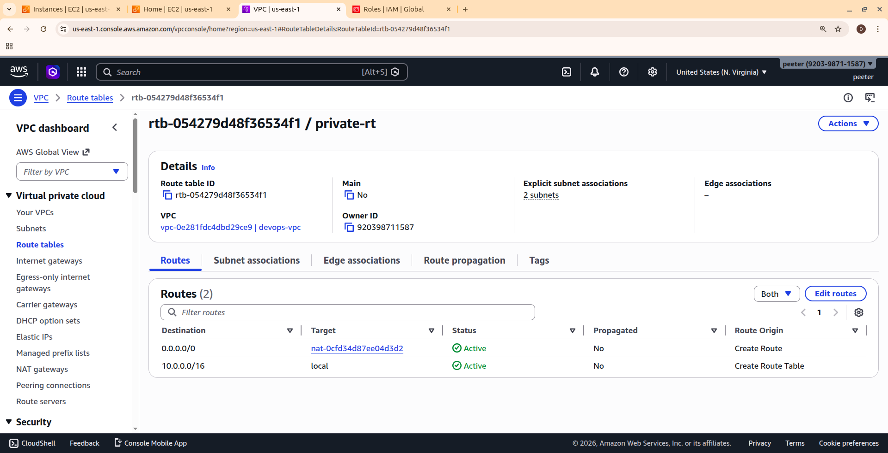

### Security Groups
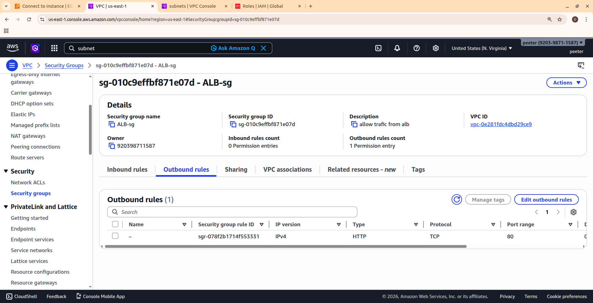
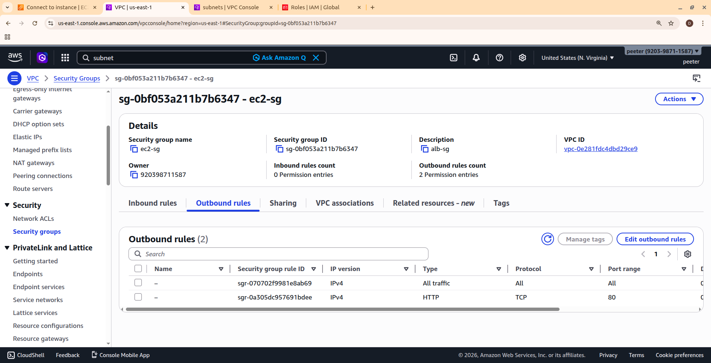

### Private EC2 Instances
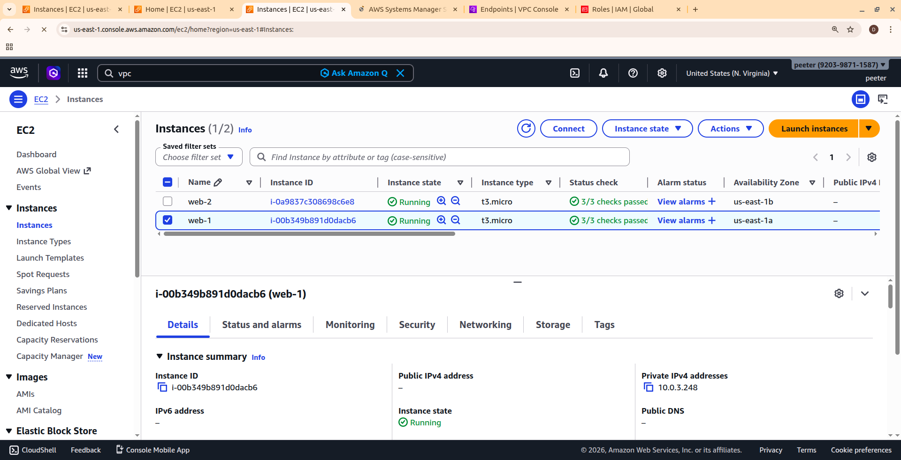

### Nginx Setup
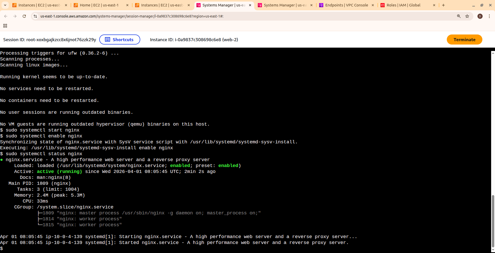
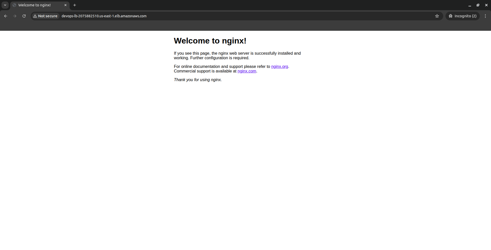

### Local Testing
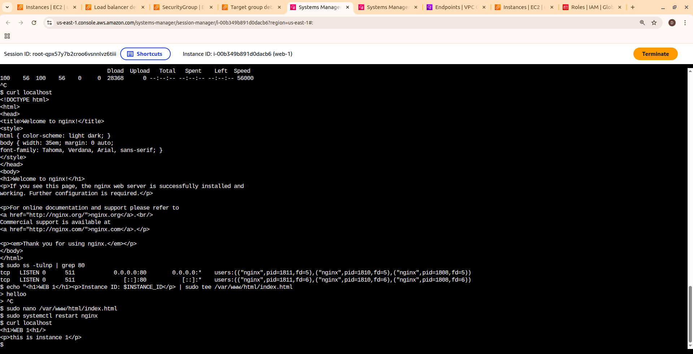

### Load Balancer
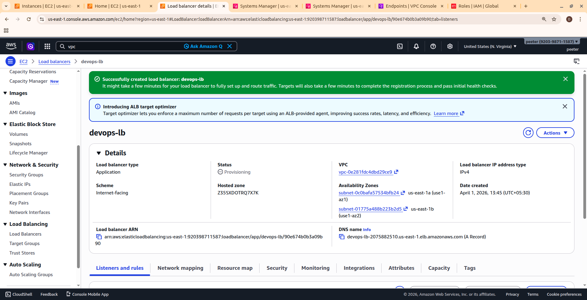

### Target Group
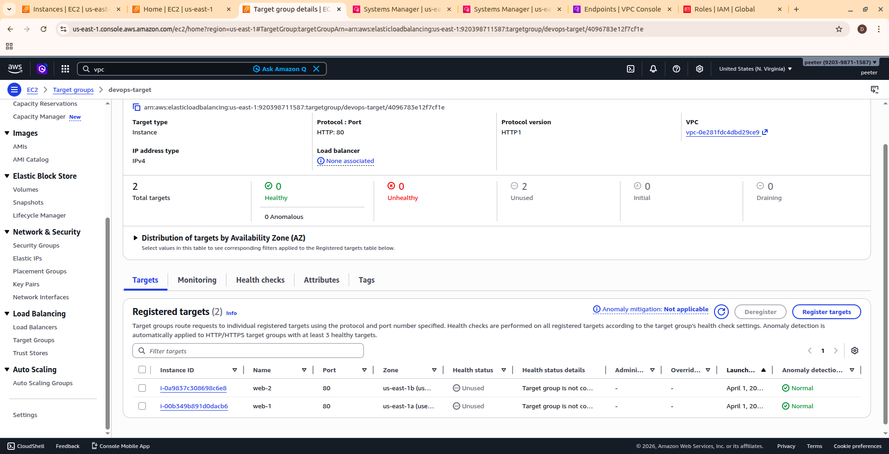

### Load Balancer Routing

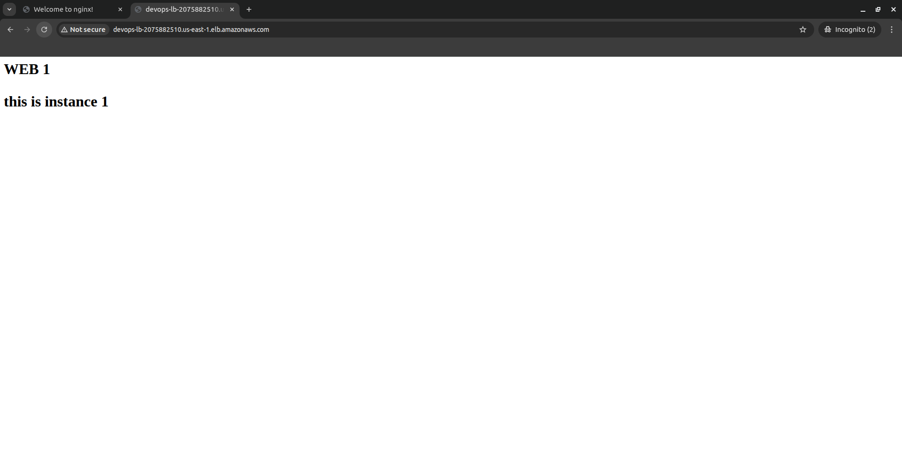

### SSM Session Manager
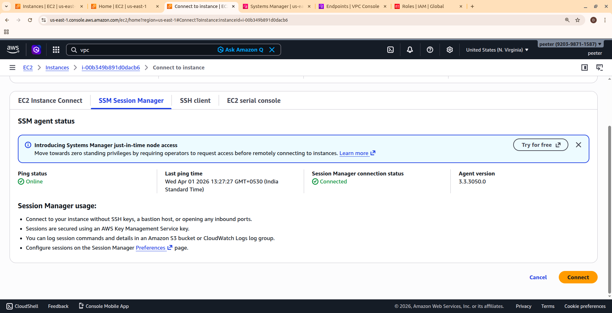

### VPC Endpoints
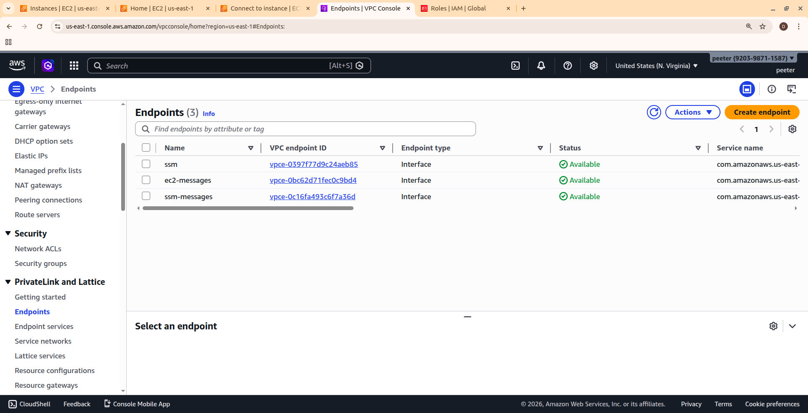

### Final Deployment
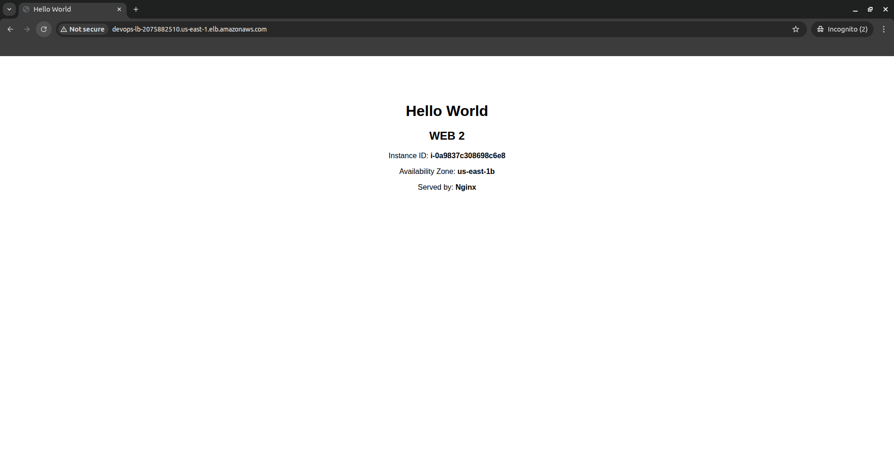
